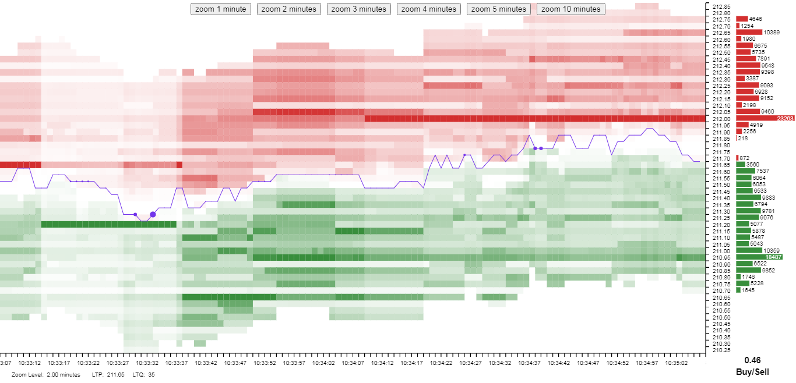

# @rongmz/react-stock-heatmap

> This is a react chart library for genarating &quot;Stock Heatmap&quot; with given market depth data. Stock Heatmap graph useful for day traders.

[](https://www.npmjs.com/package/@rongmz/react-stock-heatmap) [](https://standardjs.com)


**[Live Demo Here](https://rongmz.in/react-stock-heatmap/)**


## Screenshot



## Install

```bash
npm install --save @rongmz/react-stock-heatmap
```

## Usage

```jsx
import React from 'react'
import StockHeatmap from '@rongmz/react-stock-heatmap';

class Example extends React.Component {

  heatmapRef = React.createRef();

  loadDataFromFile = () => {
    // Somehow load market depth datapoints
    ...
    ...
    // set the data to StockHeatmap to render graph
    if(heatmapRef.current !== null) {
      heatmapRef.current.setData(data);
    }
  }

  onLiveDataReceived = (data) => {
    // Add more data to existing data. This is useful for live graphing.
    if(heatmapRef.current !== null) {
      heatmapRef.current.addData(data);
    }
  }

  render() {
    return <StockHeatmap ref={heatmapRef} width={800} height={600} />
  }

}
```


## License

MIT © [Rounak Saha](https://github.com/rongmz)
